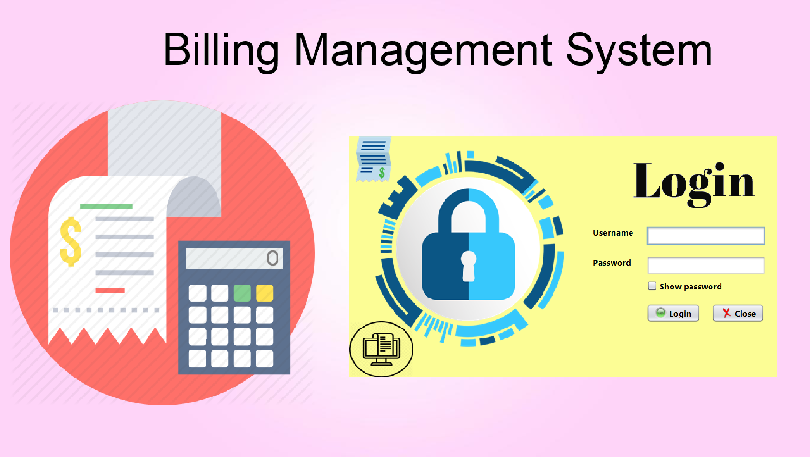
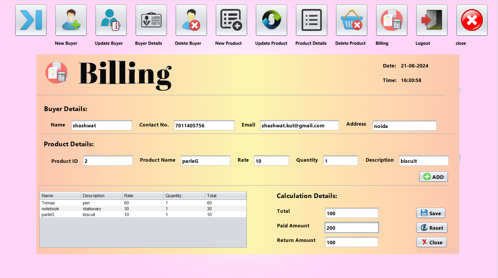

# Billing Management System

## Overview

The **Billing Management System** is a comprehensive application designed to streamline and automate the process of managing buyers and products for retail stores. This system provides an intuitive interface for handling billing, tracking buyers and products, and generating detailed invoices. With the ability to manage customer and product information efficiently, the system simplifies store operations while offering the ability to generate and send PDF bills to customers.

## Features

- **Login Page**  
  Secure login functionality to ensure only authorized users can access the system.


- **Home Page**  
  The Home Page acts as the main dashboard, allowing you to choose from the following options:
  - **New Buyer**: Add a new buyer's details to the system.
  - **Update Buyer**: Modify an existing buyer's details.
  - **Delete Buyer**: Remove a buyer's information from the system.
  - **New Product**: Add new product details to the store's inventory.
  - **Update Product**: Modify the details of existing products.
  - **Delete Product**: Remove product information from the store's inventory.
  - **Billing**: Generate a PDF bill and send it to the customer.
  
- **Buyer Management**  
  - Save new buyer details in the system.
  - Update existing buyer details.
  - Delete buyer information from the system.

- **Product Management**  
  - Add new products to the store inventory.
  - Update existing product details.
   

- **Billing**  
  - Generate PDF bills for purchases.
  - Send the generated bill directly to the customer via email or other communication methods.
   
  

## How to Use

1. **Login**: Enter your credentials to log in to the system.
2. **Manage Buyers**: Add, update, or delete buyer information easily through the buyer management interface.
3. **Manage Products**: Add new products to the inventory, or update product details when necessary.
4. **Generate Bills**: After a purchase, generate a detailed bill in PDF format, which can be printed or sent to the customer directly.

## Technologies Used

- **Backend**: Java
- **Frontend**: JFrame, AWT
- **Database**: MySQL
- **PDF Generation**: PDFKit

## Installation

1. Clone the repository:
   ```bash
   git clone https://github.com/shashwatkul/Billing_Management_System.git
